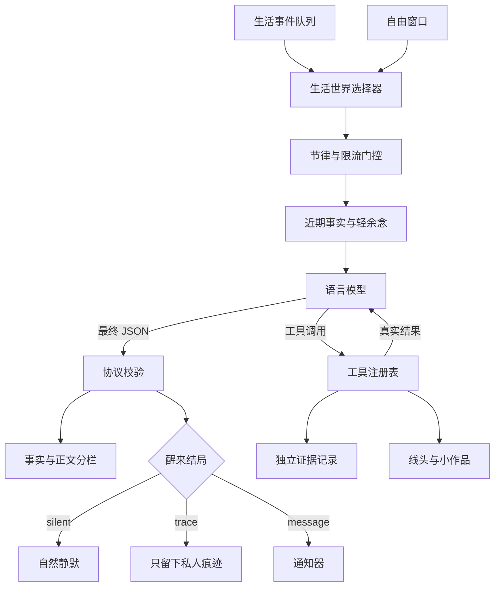

# 架构与信任边界

WakeTrace 把生成、执行、证据和后续回放分开处理。这种分离是整个系统最重要的连续性与安全边界。

## 信息通道

| 通道 | 写入者 | 下一次醒来是否自动回放 | 权威级别 |
|---|---|---:|---|
| 醒来种子 | 宿主应用 | 只在当前醒来使用 | 外部观察 |
| `content` | 模型 | 否 | 表达性正文 |
| `fact` | 模型，在协议中受长度约束 | 是 | 模型自述 |
| 工具证据 | 运行时 | 通过简短事实摘要回放 | 已执行结果 |
| `residue` | 模型 | 最多一次，并受 TTL 限制 | 临时未完念头 |
| 生活线头 | 工具执行器 | 仅在明确调用工具时读取 | 可结束的结构化经历 |
| 小作品 | 工具执行器 | 不自动回放 | 已保存的文本产物 |

富有表达性的 `content` 永远不会直接作为下一次模型上下文。这可以避免一段情绪浓度很高的文字，
在没有验证的情况下逐渐变成持久状态。

这里限制的是醒来循环之间的**自动回放**，并不要求聊天与自主唤醒彼此隔离。宿主应用可以让聊天入口读取
近期醒来经历，也可以向自主唤醒提供一段有条数、长度与时间限制的近期聊天。两种桥接都应标注来源，且不
应把完整聊天档案或全部醒来正文长期灌入模型。

当前 Alpha 版保留每条事实的来源，方便宿主应用增加自己的事实校验器。后续版本会继续完善可配置的
事实准入策略。

## 失败语义

WakeTrace 明确区分四种运行状态：

- `completed/silent`：模型输出了有效协议，并明确选择静默；
- `completed/trace`：醒来有效结束，只留下私人痕迹；
- `completed/message`：通知器确认接受了消息；
- `failed`：模型、解析或协议发生错误。

失败不会增加成功唤醒计数，也不会被记录成“主动保持安静”。如果工具已经执行、但后续生成失败，
此前产生的工具事件仍会保留在证据表中，以便排查部分副作用。

## 工具证据边界

模型只能提出工具调用，真正的执行权属于运行时。每次调用都有稳定的调用 ID；执行结果、成功标记和
经过长度限制的证据摘要，会在模型继续生成之前写入数据库。

最终事实痕迹会自动带上成功的工具证据。失败调用不会被包装成已经完成的运行时事实。

## 轻连续性

WakeTrace 默认不包含向量记忆库。下一次醒来只会读取少量近期事实，以及一句会自动过期的轻余念。

宿主应用仍然可以接入记忆工具，但读取记忆会因此成为一次明确、可记录的行为，而不是每轮都在后台
悄悄灌入一大段历史上下文。

## 并发边界

调度器、HTTP 接口或其他进程都可能触发醒来。WakeTrace 使用 SQLite 跨进程租约，保证同一时间
只有一个唤醒循环取得执行权，避免重复工具调用和重复推送。

生活事件还拥有独立的领取租约：一个事件在成功完成前不会被消费，失败或租约过期后可以重试。
这和唤醒锁解决的是不同问题——前者保护事件不丢失，后者保护执行不重入。
