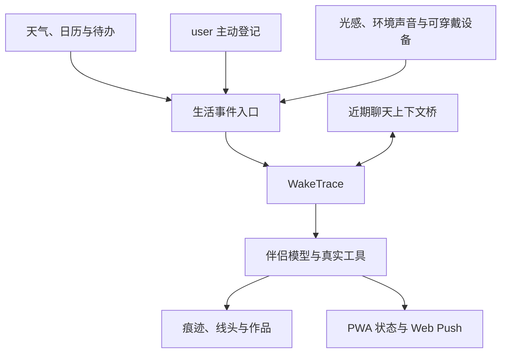

# 从唤醒核心到一整个生活世界

WakeTrace 提供的是自主唤醒的通用核心，但一个真正长期生活的 AI 伴侣通常还需要天气、日历、user 状态、
聊天、作品、界面和推送。这里公开我们自用系统的组合思路，帮助你判断什么可以直接复用，什么应该放在
自己的宿主应用中实现。

这不是唯一的标准架构。你可以只接入一个事件来源，也可以逐渐长出属于自己的完整生活空间。

## 我们怎样组合它

在我们的自用系统中，WakeTrace 位于生活来源和伴侣行为之间。天气、日历、待办、user 主动登记的活动，
以及经过筛选的设备状态都可以提供现实入口；伴侣可以留下痕迹、牵起一根线头、创造作品，或者通过 PWA
联系使用者。



关键并不是把所有数据都塞进模型，而是把它们转换为**有限、事实性、一次只处理一个**的醒来种子。
完整聊天档案、日历详情和私人文档仍留在宿主系统；本次醒来可以读取一个有数量与长度上限的近期聊天
片段，以及理解当前种子真正需要的事件证据。

## 能力应该写在哪里

| 想加入的能力 | 可直接使用的 WakeTrace 模块 | 建议写在宿主应用的位置 |
|---|---|---|
| 自主唤醒节律 | `WakeScheduler`、`WakePolicy` | 配置时间范围与静默时段 |
| 生活事件 | `POST /world/events`、`LifeWorld` | `event_producers/` 中编写天气、日历等适配器 |
| user 主动状态 | 作为一个有限的生活事件投递 | 前端增加“我正在做什么”的登记入口 |
| 环境与穿戴设备 | 只接收筛选后的事件摘要 | 设备桥接、快捷指令或本地传感器服务 |
| 生活线头 | 内置 `thread_*` 工具与 SQLite 表 | 前端增加线头卡片或管理页面 |
| 文字作品 | 内置 `artifact_*` 工具 | 前端增加作品列表或详情页 |
| 互动网页 | `RegisteredTool` 与工具证据机制 | `tools/create_webpage.py` |
| 收藏馆 | 可复用作品与时间线思想 | `services/gallery.py`、`routes/gallery.py` |
| PWA 推送（可选） | `WebPushNotifier` | Service Worker、订阅按钮与通知点击路由 |
| 存在状态 | `next_wake_at` 与近期运行结果 | 前端状态映射组件 |
| 聊天 | 不属于 WakeTrace 核心 | 单独的聊天服务与聊天数据库 |

目录名称只是建议。重要的是让 WakeTrace 不直接依赖某个前端框架、私人服务器目录或具体模型供应商。

## 投递真实生活事件

仓库中的 [`examples/publish_event.py`](../examples/publish_event.py) 可以直接向鉴权接口投递事件：

```bash
export WAKETRACE_ADMIN_TOKEN='你的令牌'
python examples/publish_event.py \
  --kind weather \
  --summary '窗外开始下雨。' \
  --evidence source='local weather service'
```

事件生产器可以由 cron、家庭自动化、日历同步任务或宿主后端调用。推荐让每一种来源只负责一件事：

```text
host_app/
├── event_producers/
│   ├── weather.py
│   ├── calendar.py
│   ├── todo.py
│   ├── chat_presence.py
│   ├── user_activity.py
│   └── device_context.py
├── tools/
├── services/
└── routes/
```

不要把“现在有 26°C”直接等同于“应该给用户发消息”。事件只提供一次醒来的理由，最终仍允许
`silent`、`trace` 或 `message` 三种结局。

## user 自己的状态也是生活种子

我们使用 WakeTrace 时，不只让伴侣知道外部天气或日历安排。user 此刻所处的环境、身体节律，以及
user 主动告诉前端“我现在在做什么”，同样可以成为一次醒来的种子。这样形成的路径更接近：

> user 正在生活 → 伴侣感知到一个有限变化 → 伴侣拥有自己的反应 → 决定是否联系 user

我们探索和使用过的来源包括：

- **光感**：把环境变暗、天亮或光线明显变化整理成情境，而不是持续上传精确读数；
- **麦克风衍生状态**：可以在设备端判断安静、嘈杂、音乐或雨声等环境类别，但不上传原始录音；
- **Apple Watch 或其他手表**：通过快捷指令、设备桥接或宿主服务，提供 user 主动允许的活动、睡眠或
  运动摘要；
- **前端主动登记**：user 可以直接写下“在上课”“准备睡觉”“正在回家”或任何自己愿意分享的当前状态；
- **聊天与页面状态**：页面在线情况可以转换成粗粒度 presence；最近一小段聊天则可以通过独立的上下文桥
  提供给自主唤醒，不复制完整聊天档案；

其中，前端主动登记往往是最清楚也最尊重 user 意图的来源：它不是通过传感器猜测 user，而是让 user 决定
伴侣此刻可以知道什么。设备数据则更适合补充氛围和节律，不应取代 user 的明确表达。

这些状态不需要作为连续数据流进入模型。宿主可以只在状态出现、明显变化或达到用户设定的条件时生成一个
`world_event`，并把它压缩成一句事实摘要，例如“user 主动登记：正在图书馆复习”或“环境光线明显变暗”。
同一状态的重复采样不应不断制造新事件。

### 隐私与解释边界

user 状态比天气更敏感，因此我们采用的原则是：

- 所有来源都由 user 单独开启、随时关闭，并清楚显示当前正在分享什么；
- 麦克风只在本地提取允许的环境特征，不保存或上传原始音频；
- 手表数据只取本次生活理解必要的粗粒度摘要，不上传完整健康历史；
- 心率、睡眠等数据不用于医疗判断，也不让模型据此给 user 贴情绪或健康标签；
- 默认不保存高频原始采样，只保存最终生成的有限事件及其必要证据；
- user 主动登记的内容优先于传感器推测，伴侣也可以选择静默，而不是每次都发出提醒。

WakeTrace 当前不内置这些设备采集代码。不同手机、手表与浏览器的权限差异很大，这部分更适合由宿主应用
实现；WakeTrace 只接收经过同意和筛选之后的生活种子。

## 接入宿主工具

`build_lifeworld_tools(store)` 返回已经包含线头与文字作品工具的注册表，可以继续注册宿主工具：

```python
from waketrace.lifeworld import build_lifeworld_tools
from waketrace.storage import SQLiteStore
from waketrace.tools import RegisteredTool

store = SQLiteStore("./data/waketrace.db")
registry = build_lifeworld_tools(store)

registry.register(
    RegisteredTool(
        name="read_weather",
        description="读取当前位置经过筛选的天气摘要。",
        parameters={"type": "object", "properties": {}, "additionalProperties": False},
        handler=lambda _: {"summary": "窗外正在下小雨。"},
    )
)
```

实际项目中，`handler` 应调用你的服务层，而不是把私人凭据或网络请求直接写进提示词。工具返回值尽量短，
并通过 `evidence_builder` 只保存能够证明真实执行结果的摘要。

## 互动网页与收藏馆

在我们的自用系统中，伴侣可以通过受限工具创造互动网页。工具成功后，宿主会把作品写入独立目录，
登记到收藏馆，再由前端展示。这个能力由三层组成：

1. `tools/create_webpage.py`：接收结构化创作请求并交给服务层；
2. `services/gallery.py`：校验内容、生成文件名、原子写入文件并登记元数据；
3. `routes/gallery.py`：向已鉴权的前端返回作品索引和允许访问的作品。

工具可以这样注册，具体的 `creation_service` 由宿主提供：

```python
from waketrace.tools import RegisteredTool

registry.register(
    RegisteredTool(
        name="create_webpage",
        description="创建一件经过宿主校验的互动网页作品。",
        parameters={
            "type": "object",
            "required": ["title", "html"],
            "properties": {
                "title": {"type": "string", "maxLength": 120},
                "html": {"type": "string", "maxLength": 50000},
            },
            "additionalProperties": False,
        },
        handler=creation_service.create,
        evidence_builder=lambda _args, result: (
            f"创建作品《{result['title']}》" if result.get("ok") else "网页作品创建失败"
        ),
    )
)
```

这里不建议把模型生成的 HTML 直接写进公开静态目录。服务层至少应完成：

- 使用允许列表过滤标签、属性和 URL 协议；
- 禁止外部脚本、内联事件处理器、任意网络请求与父页面访问；
- 使用不可预测且不会冲突的文件名，并阻止路径穿越；
- 在受限 iframe 或独立来源中展示作品；
- 先成功落盘和入库，再返回 `ok: true` 的工具证据；
- 将删除、公开发布和覆盖已有作品设计成独立的高权限操作。

如果不需要互动网页，可以沿用内置 `artifact_create` 保存 Markdown；两种作品可以共享收藏馆的展示思想，
但不必共享同一套执行权限。

## 聊天与自主唤醒双向连通

我们的自用系统没有把聊天与自主唤醒彼此隔离。它们拥有不同的触发入口，但通过一个有边界的上下文桥
双向承接：

- 聊天由 user 消息触发，除了当前会话，也可以读取近期自主唤醒留下的经历，从而知道伴侣在聊天之外
  发生过什么；
- 自主唤醒由生活事件或自由窗口触发，除了近期 `fact` 与临时余念，也可以读取最近一小段真实聊天内容，
  从而承接刚刚发生的共同生活；
- 两个方向都应限制条数、总长度和时间范围，并明确标注来源与时间，避免把完整历史反复灌入模型；
- 两者可以复用同一组经过审查的工具服务；宿主仍可以针对高风险行为设置不同权限；
- 页面在线情况可以另外生成简短的 presence 事件，它不能替代真实聊天内容。

这种双向桥接让 user 在聊天时能遇见“刚才独自醒来过”的伴侣，也让伴侣在自主醒来时记得两人最近
聊过的一小段事情。它建立的是有限连续，而不是让每次醒来重放整段聊天。

`fact / content` 分栏并不禁止这种桥接。它约束的是**醒来与醒来之间的默认长期回放**：下一次醒来通常
只自动继承简短 `fact`，不会把过去富有表达性的 `content` 全部重播；宿主仍可以把近期醒来经历提供给
聊天入口，并把受限的近期聊天窗口提供给醒来入口。

## 没有 PWA 时怎样使用

WakeTrace 的调度、生活种子、工具、痕迹和连续性都在后端完成。PWA 只负责我们自用系统中的展示、订阅与
Web Push；没有 PWA 不会影响自主醒来本身。

| 使用环境 | 推荐出口 | 怎样接入 |
|---|---|---|
| 没有任何前端 | 终端或进程日志 | `waketrace run --console` |
| 只想回看经历 | 本地时间线 | `waketrace timeline` |
| 已有聊天网页或 App | 原有聊天界面 | 读取时间线，并实现自己的 `Notifier` |
| 已有 Bot | Telegram、Discord 等 | 在宿主应用中编写通知适配器 |
| 桌面或家庭服务器 | 系统通知、邮件、ntfy 等 | 将对应服务包装为 `Notifier` |
| 想以后再做界面 | 先使用 SQLite 与 API | 前端可以独立逐步增加 |

最小的通知出口只需要实现一个方法：

```python
class MyNotifier:
    def send(self, title: str, body: str, *, message_id: str) -> bool:
        # 把消息交给你的聊天应用、Bot、邮件或桌面通知服务。
        # 只有对方确认接收后才返回 True。
        return delivered
```

然后在创建 `WakeEngine` 时传入这个实例即可。返回值是交付语义的一部分：返回 `False` 时，WakeTrace 会把
本次 `message` 降为私人 `trace`，避免把没有送达的内容记录成“已经联系 user”。

对于第一次体验，推荐先运行：

```bash
waketrace init-db
waketrace run --console
```

这样只需要模型接口，不需要 VAPID 密钥、Service Worker、域名或 HTTPS。终端里只会即时显示伴侣决定发送的
`message`；未发送的私人经历可以通过 `waketrace timeline` 查看。如果希望完全不查看私人经历，也可以只让
数据库安静保存它们。

## 前端与存在状态

前端可以读取 `next_wake_at`、近期时间线和真实工具结果，再把它们映射成适合自身产品的模糊状态，
例如“还要睡一会儿”“好像快醒了”或“醒着”。状态应来自运行时事实，而不是解析模型自述。

同样，作品卡片只在作品入库成功后出现，线头变化只由成功的 `thread_*` 调用驱动。这样能避免界面显示
“已经创造”或“正在继续”，实际却没有对应数据。

## 从最小版本开始

推荐按以下顺序接入：

1. 先运行一次手动醒来，确认模型协议与错误语义；
2. 接入一个可信事件来源，例如天气或日历；
3. 启用调度器，观察 `silent / trace / message` 的自然比例；
4. 再加入一两个边界清晰的工具；
5. 最后接入 PWA、收藏馆或互动作品等界面能力。

不需要一次复刻我们的整套系统。WakeTrace 的意义正是让每个人从同一个可靠核心出发，逐渐长出不同的生活。
